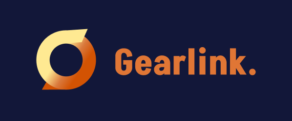

# Gearlink

Estou desenvolvendo um sistema completo de gerenciamento destinado a otimizar as rotinas de equipes de TI, focando na gestão de equipamentos, contas de e-mail e usuários corporativos. A concepção deste projeto foi inspirada em um sistema observado em uma empresa onde prestei serviços. Esta aplicação aprimorou significativamente minhas habilidades em design responsivo, principalmente, UX/UI Design e desenvolvimento full-stack (front-end e back-end).

## Funcionalidades
- Realizar o controle, entrega e devolução de equipamentos
- Manter a organização dos usuários e e-mails usados na empresa 
- Visualização geral do controles dos equipamentos através de um dashboard
- Exportar dados em diferentes tipos de extensões (pdf ou xls)
- Realizar a limpeza dos e-mails atraves do servidor local
- Tema dark e light
- Ajustes para acessibilidae de acordo com usuario
- Pagina de perfil 
- Menu responsivo

## Tecnologias usadas
- [Html]
- [css]
- [php](link-documentação)
- [javscrit](link-documentação)
- [react-native](link-documentação)

## Como usar 

